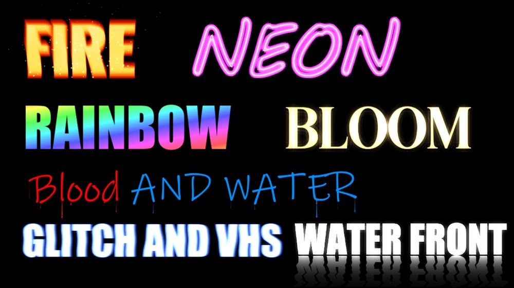
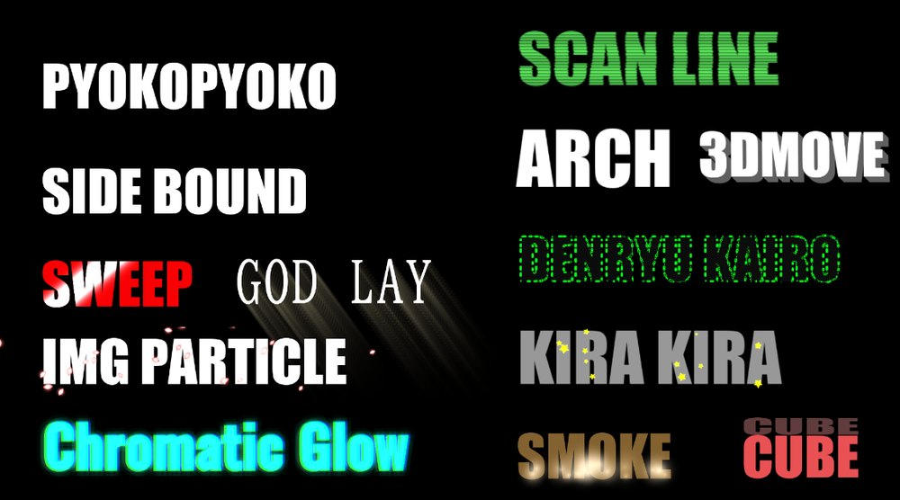

# Font Effect Tools（OBS ソースプラグイン）

入力したテキストにさまざまな**エフェクト**を適用して表示する OBS Studio の
**入力ソース**です。エフェクトは複数の中から選択でき、エフェクトごとに専用の
パラメーターを持ちます。テキスト・フォント・行間・文字間・揃え位置の設定は
エフェクトの種類を横断して共有されます。

`obs-plugintemplate` のツールチェインと FreeType をベースにしており、フォント
処理は姉妹プラグイン `dokavendor` の実績ある実装を流用しています。

OBS では **ソースの追加 →「Font Effect Tools」** に表示されます（内部 id は
`flame_text_source`）。

## パッケージの構成

`dist` インストールコンポーネント（配布 ZIP）は、配布するそのままのツリーを
出力します。

```
package/
├─ bin/
│   ├─ font-effect-tools.dll
│   └─ font-effect-tools.pdb
├─ font-effect-tools/
│   ├─ effects/*.effect（flame, spark, rainbow, neon, bloom, waterdrop,
│   │                    glitch, watersurface, spotlight, chroma, godray,
│   │                    scanline, arc, circuit, sprite, textfill, outline,
│   │                    glow, slice, slime, wave の全 21 ファイル）
│   └─ locale/{en-US,ja-JP}.ini
├─ README.md
├─ LICENSE
└─ SOURCE-NOTICE.txt
```

## OBS へのインストール

モジュール名は `font-effect-tools` なので、OBS データディレクトリ名も
**必ず** `font-effect-tools`（DLL のベース名と一致）にします。2 つの部分を
次のように配置します。

- `bin/` 配下のファイルすべて → `<obs>/obs-plugins/64bit/` 配下へ
- `font-effect-tools/` フォルダ（effects + locale） →
  `<obs>/data/obs-plugins/` 配下へフォルダごとコピー

（`<obs>` は OBS のインストール先。例: `C:\Program Files\obs-studio`。）配置後は
OBS を完全に再起動してください。

## クレジット表記のお願い

配信や動画で利用する際は、概要欄などに以下のクレジットをお願いします。

```
■Font Effect Tools
開発：ヘヴィメタルバンド 503 bad gateway
Youtube：https://youtube.com/@503badgateway
X（伊達五十嵐）：https://x.com/503_bad
```

## できること
任意のテキストを、システムフォント（OBS のフォントピッカーで選択）で描画します。
以下一例です。




- **エフェクト選択ドロップダウン**で表示効果を切り替えます。現在は次の 27 種類:
  - **エフェクトなし (None)** — テキストを指定色でそのまま描画します。オプションで
    **輪郭線**・**ドロップシャドウ**・**背景色**を追加できます。
  - **炎 (Flame)** — テキストの形を GPU シェーダーで炎として描画。FBM ノイズの
    乱流が時間とともに上方向へスクロールし、白〜黄の熱い根元から赤・煙状の先端
    へと変化します。さらに **火の粉パーティクル**（CPU シミュレーション）を
    テキストの上端または下端から放出し、加算合成の **ブルーム** で発光させます。
  - **レインボー (Rainbow)** — テキストの形を、時間で流れる虹色グラデーションで
    塗りつぶします。角度・色数・速度・彩度・明度を調整できます。
  - **ネオン (Neon)** — テキストの**輪郭線**だけを発光するネオン管として描画します
    （文字の内側は中空＝透明）。マスクの被覆率を多点サンプリングでぼかして輪郭
    からの距離を近似し、白く光る芯＋指定色のグロー＋ブルーム（にじみ）を生成。
    定期的なちらつき（光量が一瞬強くなって緩やかに戻る）も加わります。
  - **ブルーム (Bloom)** — テキストを指定色で**ベタ塗り**にして発光させ、太い
    部分の芯を白熱させつつ、外周へ柔らかいハロー（ブルーム）を放射します。
    ブルームの強さは時間とともに**ランダムに増減**し、さらに微小な**ゆらめき**
    が加わって生きた光に見せます。広さ・光の強さ・色を調整できます。
  - **水滴 (Water Drip)** — 文字を**フォント色でベタ塗り**したうえに、文字の
    **下の頂点**（グリフ下輪郭の局所最下点）から水滴が生まれ、表面張力で一旦
    溜まってから**指定した距離まで**垂れ落ち、**つたった跡（ウェットなトレイル）**
    を残します。垂れ終わると指定時間で薄れて消えます。空白部分（文字間の隙間）
    からは滴りません。CPU シミュレーションの半透明ドロップ（ハイライト付きの
    ガラス質）を専用シェーダーで描画します。フォント色・水滴の色・量・頻度・
    垂れる距離（＋ばらつき）・大きさ（＋ばらつき）・消えるまでの時間を調整できます。
    このエフェクトは滴が落ちる縦の空間を確保するため、**垂れる距離に応じて**
    キャンバスの下余白を自動で確保します。
  - **グリッチ (Glitch)** — テキストを指定色で描画し、設定した**頻度**で短い
    グリッチを**バースト**的に発生させます。発生中は **RGB チャンネルの分離
    （色収差）**、**水平スライスのずれ**（トラッキング乱れ風）、**ブロック欠け
    （データロス）** がまとまって起こり、合間は静止します。歪みの量は強さに
    比例し、頻度・強さ・テキストの色を調整できます。さらにバーストとは独立した
    仕上げレイヤーとして、**発光**（文字本体の発光）・**ブルーム**（外周の光の
    にじみ）・**VHSのようなブレ**（横揺れ＋右方向の残像）を、それぞれ強度を
    個別に指定して重ねられます。
  - **水面 (Water Surface)** — テキストを指定色で描画し、その**下端（水面）から
    上下反転した反射**を水面に映します。反射は**さざ波（横揺れ）**または
    **中央から広がる同心円**のいずれかで波打ち、**下へ行くほど薄くフェード**します。
    波の強さ・周波数・速さ・ランダム（不規則さ）、反射の濃さ・フェード量を調整でき、
    **発光**（文字本体の発光）と**ブルーム**（外周の光のにじみ）は**正立テキストと
    反射の両方**にかかります。反射が収まるよう、キャンバスの下余白を自動で確保します。
  - **スポットライトスイープ (Spotlight sweep)** — テキストの上を光の帯が指定角度で
    スイープし、通過した部分をハイライトします。光の色・強さ・帯の幅・走査の速さ・
    角度を調整でき、輪郭線も追加できます。
  - **クロマティックグロー (Chromatic glow)** — RGB チャンネルを水平にずらした
    **色収差**と、時間とともに色相が回転する**グロー**を重ねます。強度・回転速度・
    ずらし量・グローを調整できます。
  - **ゴッドレイ (God rays)** — テキストから指定角度へ**光芒（光の筋）**を放射します。
    光芒の長さ・強さ・揺らぎを調整できます。光芒が収まるよう、キャンバスの余白を
    全方向に自動で確保します。
  - **スキャンライン (Scanlines)** — テキストにレトロ CRT モニター風の**走査線**を
    重ねます。走査線の強度・密度・明滅・にじみを調整できます。
  - **電気アーク (Electric arc)** — テキストの周囲に**稲妻状の放電アーク**を断続的に
    走らせ、グローとブルームで発光させます。発生頻度とランダムさを調整できます。
  - **電流回路 (Current circuit)** — 暗いベタ塗りのテキストの**輪郭に沿って発光
    パルスが走行**し、電子回路のような見た目になります。走行速度・ランダム・発光・
    ブルームを調整できます。
  - **キラキラ (Sparkle)** — テキスト表面に**星型のきらめき**が生まれては明滅して
    消えます。量・大きさ・きらめき速度を調整でき、輪郭線も追加できます。
  - **砂煙吹き上がり (Dust plume)** — テキストの下端から**砂煙状のパーティクル**が
    吹き上がり、横に流れながら拡散して消えます。量・上昇の速さ・横流れ・寿命を
    調整できます。
  - **画像パーティクル装飾 (Image decoration)** — ハート・星・花びらなどの**シェイプ
    （または任意の画像ファイル）**がテキストの周囲を回転しながら舞い落ちます。
    形状・色合い・量・大きさ・回転・発光を調整できます。
  - **疑似3D厚み (Pseudo-3D thickness)** — テキストに**側面の厚み**を付けた疑似 3D
    表示にし、ゆらゆら揺れと**お辞儀のような前傾**アニメーションを加えます。
  - **キューブ展開 (Cube unfold)** — テキストを**キューブの面**として回転・展開する
    ループアニメーションで表示します。逆再生ループや輪郭線も選べます。
  - **横バウンド整列 (Side bounce align)** — 各文字が**横から飛び込み、バウンドして
    定位置に整列**し、停止時間の後に反対側へ退場するループアニメーションです。
  - **ぴょこぴょこ跳躍 (Hop)** — 各文字が順に飛び込み、**スクワッシュ＆ストレッチ**
    付きでぴょこぴょこ跳ねてから退場するループアニメーションです。
  - **カウンター (Counter)** — スロットマシン風。全文字が**文字コード順で手前にある
    文字**（最大 20 文字、フォントが持たない文字＝豆腐はスキップ）を高速に表示しながら
    回転し、左の文字から順に確定していきます。揃うまでの秒数を指定でき、グロー・
    輪郭線・シャドウ・ループ（待機時間付き）に対応します。
  - **スライス (Slice)** — テキストを**指定した分割数の斜めバンド**に切り、偶数番と
    奇数番のバンドが切断線に沿って斜め上・斜め下から逆方向にスライドインして合体
    します。角度・分割数・速さ・距離を指定でき、ループ時は逆再生で退場します。
  - **上下スライドイン (Vertical slide-in)** — 1 文字ずつ、**上と下から交互に**
    フェードインしながら定位置へスライドします。開始位置（左右）・進入角度・速さ・
    距離を指定でき、ループ時は逆再生で退場します。
  - **ランダム震え (Random jitter)** — 各文字が**独立してランダムに**ふわふわと
    震えます。震えの速さ・距離・加速方法（**等速**＝一定速度で移動 / **バウンス**＝
    目標へ勢いよく飛び込んで揺り戻る）を指定できます。ループ ON にすると
    「震え→静止→震え」を繰り返します（OFF は常時震え）。
  - **スライム (Slime)** — テキストが**ゼリーのようにプルプル**揺れます。下端は
    ほぼ固定のまま、ランダムなタイミングで上部がバウンドし、減衰バネで揺れが
    収まります。頻度・柔らかさ・横揺れ・縦揺れを指定できます。
  - **ウェーブ (Wave)** — テキストの中心から**水面のような同心円の波**が放射状に
    広がり、文字が波打ちます。波の周期・ランダム・強さ・速さを指定できます。
- グリフの外側まで効果がはみ出せるよう、余白を持たせたキャンバスに描画します
  （フィルタではなく*ソース*である理由）。
- テキスト/フォント/行間/文字間/揃え位置は全エフェクト共通。エフェクトを切り替えても
  各エフェクトのパラメーターはインスタンスごとに保持されます。

## アーキテクチャ

エフェクトは「インターフェース（関数ポインタの構造体）＋レジストリ」で
差し替え可能な構造になっています。ホスト（ソース本体）は共有のテキスト/
フォント/マスク生成と、選択中エフェクトへの委譲だけを担当します。

| ファイル | 役割 |
| --- | --- |
| `src/plugin-main.c` | モジュールのエントリ。ソースを登録 |
| `src/flametext-source.c/.h` | ホスト。共有テキスト/フォント/マスク、エフェクト選択、プロパティ UI、描画ループ |
| `src/effect-base.h` | エフェクトのインターフェース（`text_effect` 構造体、`fx_render_ctx`） |
| `src/effect-registry.c/.h` | 利用可能なエフェクトの一覧（レジストリ） |
| `src/effect-none.c/.h` | エフェクトなし（ベタ塗り＋輪郭線／ドロップシャドウ／背景色） |
| `src/effect-flame.c/.h` | 炎エフェクト（炎シェーダー＋火の粉パーティクル） |
| `src/effect-rainbow.c/.h` | レインボーエフェクト（グラデーション塗り） |
| `src/effect-neon.c/.h` | ネオンエフェクト（輪郭線のネオン管＋グロー＋ちらつき） |
| `src/effect-bloom.c/.h` | ブルームエフェクト（ベタ塗り＋外周グロー＋ランダム強弱／ゆらめき） |
| `src/effect-water.c/.h` | 水滴エフェクト（下輪郭の頂点から滴る半透明ドロップ＋トレイル） |
| `src/effect-glitch.c/.h` | グリッチエフェクト（RGB 分離＋水平ずれ＋ブロック欠けをバースト発生） |
| `src/effect-watersurface.c/.h` | 水面エフェクト（下端から上下反転した反射＋さざ波／同心円＋発光／ブルーム） |
| `src/effect-spotlight.c/.h` | スポットライトスイープ（光の帯の走査ハイライト） |
| `src/effect-chroma.c/.h` | クロマティックグロー（RGB ずらし＋色相回転グロー） |
| `src/effect-godray.c/.h` | ゴッドレイ（指定角度への光芒の放射） |
| `src/effect-scanline.c/.h` | スキャンライン（CRT 風の走査線＋明滅／にじみ） |
| `src/effect-arc.c/.h` | 電気アーク（稲妻状の放電＋グロー／ブルーム） |
| `src/effect-circuit.c/.h` | 電流回路（輪郭に沿って走行する発光パルス） |
| `src/effect-sparkle.c/.h` | キラキラ（星型のきらめきパーティクル） |
| `src/effect-dust.c/.h` | 砂煙吹き上がり（下端から上昇する砂煙パーティクル） |
| `src/effect-imagedeco.c/.h` | 画像パーティクル装飾（シェイプ／任意画像の舞い落ち） |
| `src/effect-depth3d.c/.h` | 疑似3D厚み（側面押し出し＋ゆらゆら／お辞儀） |
| `src/effect-cube.c/.h` | キューブ展開（面の回転・展開ループ） |
| `src/effect-sidebound.c/.h` | 横バウンド整列（文字単位の飛び込み＋バウンド） |
| `src/effect-hop.c/.h` | ぴょこぴょこ跳躍（文字単位の跳躍＋スクワッシュ＆ストレッチ） |
| `src/effect-counter.c/.h` | カウンター（中間文字アトラスを FreeType で生成＋左から順に確定） |
| `src/effect-slice.c/.h` | スライス（斜めバンド分割＋逆方向スライドイン） |
| `src/effect-slidein.c/.h` | 上下スライドイン（文字単位の上下交互フェードイン） |
| `src/effect-jitter.c/.h` | ランダム震え（文字単位のランダムワンダリング） |
| `src/effect-slime.c/.h` | スライム（減衰バネ駆動のゼリー歪み） |
| `src/effect-wave.c/.h` | ウェーブ（中心からの放射状リップル歪み） |
| `src/flametext-text.c/.h` | FreeType → 余白付きの単一カバレッジマスクテクスチャ（＋下輪郭プロファイル） |
| `src/flametext-particles.c/.h` | CPU 火の粉プール（構造体配列）と加算描画 |
| `src/flametext-font-resolve-win.c` | フォント名 → ファイルパス解決（Windows） |
| `data/effects/flame.effect` | 上昇する炎のフラグメントシェーダー |
| `data/effects/spark.effect` | 加算合成の火の粉スプライトシェーダー（ブルーム付き） |
| `data/effects/rainbow.effect` | 虹色グラデーション塗りのシェーダー |
| `data/effects/neon.effect` | 輪郭抽出＋ネオン管／グロー描画のシェーダー |
| `data/effects/bloom.effect` | ベタ塗り＋芯の白熱＋外周ハロー描画のシェーダー |
| `data/effects/waterdrop.effect` | 半透明の水滴（ガラス質ハイライト）とウェットなトレイルのシェーダー |
| `data/effects/glitch.effect` | RGB 分離・水平スライスずれ・ブロック欠けのグリッチシェーダー |
| `data/effects/watersurface.effect` | 上下反転反射＋さざ波／同心円の歪み＋深さフェード＋発光／ブルームのシェーダー |
| `data/effects/spotlight.effect` | 光の帯の走査ハイライトのシェーダー |
| `data/effects/chroma.effect` | RGB ずらし＋色相回転グローのシェーダー |
| `data/effects/godray.effect` | 光芒の放射のシェーダー |
| `data/effects/scanline.effect` | CRT 風走査線のシェーダー |
| `data/effects/arc.effect` | 稲妻状の放電アークのシェーダー |
| `data/effects/circuit.effect` | 輪郭走行する発光パルスのシェーダー |
| `data/effects/textfill.effect` | テキストのベタ塗り描画の共有シェーダー（多数のエフェクトが使用） |
| `data/effects/outline.effect` | 輪郭線描画の共有シェーダー |
| `data/effects/glow.effect` | グローハロー描画の共有シェーダー（カウンター／スライドイン／震え） |
| `data/effects/sprite.effect` | パーティクルスプライト描画の共有シェーダー（キラキラ／砂煙／画像装飾） |
| `data/effects/slice.effect` | 斜めバンド分割スライド＋影／輪郭／グロー合成のシェーダー |
| `data/effects/slime.effect` | 下端アンカーのゼリー歪みシェーダー |
| `data/effects/wave.effect` | 放射状リップル歪み＋影／輪郭／グロー合成のシェーダー |

### エフェクトのインターフェース

各エフェクトは `text_effect`（`src/effect-base.h`）を実装します。主なコール
バック:

- `create` / `destroy` — インスタンスごとの状態の確保・解放
- `load_graphics` — シェーダー等の GPU リソース読み込み
- `update` — 自分のパラメーターを設定値から読み出す
- `set_mask` — 共有テキストマスクが再生成されたときの追従（放出位置など）
- `tick` — シミュレーションの時間進行
- `render` — 1 フレームの描画
- `reset` — `show()` 時などの一時状態リセット
- `get_properties` / `get_defaults` — 自分のプロパティと既定値

スレッド契約: `load_graphics` / `render` / `destroy` は OBS のグラフィックス
ロック保持下で、それ以外はロック無しで呼ばれます（不要なコールバックは NULL 可）。

### テキスト描画の方式

`dokavendor` の **FreeType** 統合と Windows のフォント名→パス解決を流用し、
システムフォントによるフルラスタライズを行います。テキストは余白付きキャンバス
に **1 枚のグレースケールカバレッジマスク**（`GS_R8`）として焼き込まれ、各
エフェクトはこのマスクを共通の入力（＝テキスト入力）として使用します。炎
エフェクトはこのマスクを燃料として参照し、火の粉エミッターはマスクのテキスト
帯（上端/下端）から放出位置を読み取ります。

## 描画パイプライン（1 フレーム）

1. 設定変更時に `flametext-text` がカバレッジマスクを生成（グラフィックスロック
   下）。テキストはキャンバス下方に配置され、上方にフォントサイズの約 2.4 倍の
   余白を確保します。生成後、全エフェクトの `set_mask` に通知します。
2. `video_tick(dt)` でホストのクロックを進め、**選択中エフェクト**の `tick` を
   呼びます（デルタタイム駆動でフレームレート非依存）。
3. `video_render` で**選択中エフェクト**の `render` を呼びます。
   - 炎: キャンバス全面に `flame.effect`（アルファ合成）＋ 火の粉を `spark.effect`
     で一括加算描画。粒子ごとの `(heat, brightness)` は `TEXCOORD1` で渡し、
     シェーダーのホットコア＋広いハローでブルームを生成します。
   - レインボー: キャンバス全面に `rainbow.effect`（アルファ合成）。

## プロパティ

### 共通

| プロパティ | 範囲 | 既定値 |
| --- | --- | --- |
| テキスト | — | `test` |
| フォント（システムピッカー） | — | Impact |
| 行間 | オート / ピクセル指定（1 – 2000 px・ベースライン間隔） | オート |
| 文字間 | オート / ピクセル指定（-500 – 1000 px・送り幅に加算） | オート |
| 揃え位置 | 左揃え / 中央揃え / 右揃え（ラジオボタン） | 中央揃え |
| エフェクト | 全 27 種類（上記「できること」参照） | 炎 |

> - **行間**のピクセル指定はベースライン間隔の絶対値、**文字間**のピクセル指定は
>   フォント本来の送り幅に加算する値です（負の値で詰められます）。
> - **揃え位置**は複数行テキストの各行をブロック内で左／中央／右に揃えます。

選択中のエフェクトのパラメーターグループのみが表示されます。

### エフェクトなし (None)

| プロパティ | 範囲 | 既定値 |
| --- | --- | --- |
| フォントの色 | カラーピッカー | 白 `#FFFFFF` |
| 輪郭線を表示 | オン / オフ | オフ |
| 輪郭線の太さ (px) | 1.0 – 20.0 | 4.0 |
| 輪郭線の色 | カラーピッカー | 黒 `#000000` |
| ドロップシャドウ | オン / オフ | オフ |
| 影の色 | カラーピッカー | 黒 50% `#000000` |
| 影の横オフセット (px) | -100 – 100 | 4 |
| 影の縦オフセット (px) | -100 – 100 | 4 |
| 背景色 | カラーピッカー | 透明 |

### 炎 (Flame)

| プロパティ | 範囲 | 既定値 |
| --- | --- | --- |
| 炎の高さ | 0.0 – 0.2 | 0.10 |
| 揺らぎ速度 | 0.1 – 3.0 | 1.10 |
| 色温度 | 0.5 – 2.0 | 1.00 |
| 炎の強度 | 0.3 – 2.5 | 1.00 |
| 火の粉の放出量 | 0 – 1500 | 150 |
| 火の粉の初速 | 40 – 600 | 140 |
| 火の粉の寿命 (秒) | 0.3 – 3.0 | 2.25 |
| 粒子サイズ | 1 – 20 | 2.0 |
| ばらつき | 0.0 – 1.0 | 1.00 |
| 火の粉の色 | カラーピッカー | 淡い黄 `#FFFFDC` |
| 火の粉の出現位置 | フォントの上 / 下 | 上 |
| 火の粉のブルーム | 0.0 – 3.0 | 1.0 |

### レインボー (Rainbow)

| プロパティ | 範囲 | 既定値 |
| --- | --- | --- |
| スクロール速度 | 0.0 – 2.0 | 0.40 |
| 色の本数 | 0.25 – 8.0 | 1.50 |
| グラデーション角度 | 0 – 360 | 90 |
| 彩度 | 0.0 – 1.0 | 0.95 |
| 明度 | 0.0 – 1.0 | 1.00 |

### ネオン (Neon)

| プロパティ | 範囲 | 既定値 |
| --- | --- | --- |
| 輪郭線を表示 | オン / オフ | オン |
| ネオンの色 | カラーピッカー | シアン `#00E5FF` |
| 管の太さ (px) | 1.0 – 12.0 | 3.0 |
| グロー半径 (px) | 2.0 – 40.0 | 14.0 |
| ブルームの強さ | 0.0 – 3.0 | 1.0 |
| 全体の明るさ | 0.2 – 3.0 | 1.0 |
| ちらつき頻度 | 0.0 – 5.0（0 で停止） | 1.0 |

### ブルーム (Bloom)

| プロパティ | 範囲 | 既定値 |
| --- | --- | --- |
| ブルームの色 | カラーピッカー | 暖色 `#FFD27F` |
| ブルーム広さ (px) | 2.0 – 60.0 | 20.0 |
| 光の強さ | 0.2 – 3.0 | 1.0 |
| 強弱のランダム | 0.0 – 1.0（0 で停止） | 0.5 |
| ゆらめき | 0.0 – 1.0（0 で停止） | 0.3 |

### 水滴 (Water Drip)

| プロパティ | 範囲 | 既定値 |
| --- | --- | --- |
| フォントの色 | カラーピッカー | 白 `#FFFFFF` |
| 水滴の色 | カラーピッカー | 淡い水色 `#BFE6FF` |
| 水滴の量（同時数の上限）| 1 – 60 | 16 |
| 頻度 (個/秒) | 0.1 – 10.0 | 1.5 |
| 垂れる距離 (px) | 0 – 2000 | 300 |
| 距離のばらつき | 0.0 – 1.0 | 0.4 |
| 水滴の大きさ（倍率）| 0.2 – 4.0 | 1.0 |
| 大きさのばらつき | 0.0 – 1.0 | 0.4 |
| 消えるまでの時間 (秒) | 0.1 – 10.0 | 2.0 |

> - **垂れる距離**は各水滴が origin（先端）から下方へ進む基準距離（px）。**距離の
>   ばらつき**は各滴の距離を `基準 ×(1 − ばらつき×乱数)` の範囲でランダムに短くします。
> - **消えるまでの時間**は、水滴が指定距離まで垂れ終わってから完全に消えるまでの
>   フェード時間です（落下中はフェードしません）。
> - **大きさ**は基準サイズの倍率、**大きさのばらつき**は各滴の大きさを基準の
>   `±ばらつき` の範囲で散らします。落下速度・トレイルの太さはこの大きさと
>   フォントサイズから自動でスケールします。
> - 発生位置はグリフ下輪郭の局所最下点（突出した先端）に限定され、文字間の空白
>   からは滴りません。下余白は **垂れる距離に応じて** 自動確保されます。

### グリッチ (Glitch)

| プロパティ | 範囲 | 既定値 |
| --- | --- | --- |
| テキストの色 | カラーピッカー | 白 `#FFFFFF` |
| 発生頻度 (回/秒) | 0.0 – 10.0（0 で停止） | 2.0 |
| グリッチの強さ | 0.0 – 1.0 | 0.5 |
| 発光 | 0.0 – 1.0 | 0.3 |
| ブルーム | 0.0 – 1.0 | 0.3 |
| VHSのようなブレ | 0.0 – 1.0 | 0.25 |

> - **発生頻度**は 1 秒あたりにグリッチが発生する回数の目安です。0 にすると
>   グリッチは止まり、テキストは静止したまま指定色で表示されます。
> - **グリッチの強さ**は RGB 分離・水平ずれ・ブロック欠けの量をまとめて
>   スケールします。0 で歪みなし。
> - **発光 / ブルーム / VHSのようなブレ**はバーストとは独立して常時かかる仕上げの
>   レイヤーで、それぞれ強度を個別に調整できます。**発光**は文字本体を明るく光らせ、
>   **ブルーム**は文字の外周へ柔らかい光のにじみを広げ、**VHSのようなブレ**は波打つ
>   横揺れと右方向への残像（輝度スメア）でアナログテープ風の質感を加えます。

### 水面 (Water Surface)

| プロパティ | 範囲 | 既定値 |
| --- | --- | --- |
| フォントの色 | カラーピッカー | 白 `#FFFFFF` |
| 波の種類 | さざ波（横揺れ）/ 同心円（中央から） | さざ波 |
| 波の強さ | 0.0 – 1.0 | 0.5 |
| 波の周波数 | 1.0 – 20.0 | 6.0 |
| 波の速さ | 0.0 – 3.0 | 1.0 |
| 波のランダム | 0.0 – 1.0 | 0.3 |
| 反射の濃さ | 0.0 – 1.0 | 0.7 |
| フェード量 | 0.0 – 1.0 | 0.6 |
| 発光 | 0.0 – 3.0 | 0.8 |
| ブルーム | 0.0 – 3.0 | 1.0 |
| ブルーム広さ (px) | 2.0 – 60.0 | 16.0 |

> - 反射はテキストの**下端（水面）で上下反転**して描かれ、**水面はテキスト下端に
>   ぴったり接します**。
> - **波の種類**で歪み方を選びます。**さざ波**は反射全体が左右に揺れ（水面から
>   離れるほど揺れが大きい）、**同心円**はキャンバス中央から波紋が広がります。
>   **波の強さ**＝振幅、**波の周波数**＝反射帯あたりの波の本数、**波の速さ**＝
>   アニメーション速度、**波のランダム**＝波の不規則さ（0 で規則的）。
> - **反射の濃さ**は水面直下での反射の不透明度、**フェード量**は下へ行くほど薄れる
>   強さです（大きいほど早く消える）。
> - **発光 / ブルーム**は**正立テキストと反射の両方**にかかります。**発光**は文字
>   本体を明るく光らせ、**ブルーム**は外周へ光のにじみを広げます（**ブルーム広さ**で
>   にじみの半径を指定）。
> - 反射が収まるよう、下余白は**フォントサイズに応じて**自動確保されます。

### スポットライトスイープ (Spotlight sweep)

| プロパティ | 範囲 | 既定値 |
| --- | --- | --- |
| フォントの色 | カラーピッカー | 白 `#FFFFFF` |
| 光の色 | カラーピッカー | 白 `#FFFFFF` |
| 光の強さ | 0.0 – 3.0 | 1.4 |
| 走査の速さ | 0.0 – 3.0 | 0.6 |
| 帯の幅 | 0.02 – 0.5 | 0.1 |
| 走査の角度 | 0 – 360 | 75 |
| 輪郭線を表示 | オン / オフ | オフ |
| 輪郭線の太さ (px) | 1.0 – 20.0 | 4.0 |
| 輪郭線の色 | カラーピッカー | 黒 `#000000` |

### クロマティックグロー (Chromatic glow)

| プロパティ | 範囲 | 既定値 |
| --- | --- | --- |
| フォントの色 | カラーピッカー | 白 `#FFFFFF` |
| 強度 | 0.0 – 1.0 | 0.7 |
| 色相の回転速度 | 0.0 – 2.0 | 0.5 |
| RGBずらし (px) | 0.0 – 12.0 | 3.0 |
| グロー | 0.0 – 3.0 | 1.0 |

### ゴッドレイ (God rays)

| プロパティ | 範囲 | 既定値 |
| --- | --- | --- |
| フォントの色 | カラーピッカー | 白 `#FFFFFF` |
| 光の色 | カラーピッカー | 暖色 `#FFF0B9` |
| 光芒の強さ | 0.0 – 2.0 | 1.0 |
| 光芒の長さ | 0.2 – 4.0 | 1.0 |
| 光の強さ | 0.0 – 3.0 | 1.2 |
| 揺らぎのランダム性 | 0.0 – 1.0 | 0.4 |
| 光芒の角度 | 0 – 360 | 110 |

> 光芒がキャンバス端で切れないよう、余白は**全方向に**自動確保されます。

### スキャンライン (Scanlines)

| プロパティ | 範囲 | 既定値 |
| --- | --- | --- |
| フォントの色 | カラーピッカー | 蛍光緑 `#66FF66` |
| 走査線の強度 | 0.0 – 1.0 | 0.6 |
| 線の密度 | 0.1 – 1.0 | 0.5 |
| 明滅 | 0.0 – 1.0 | 0.3 |
| 揺らぎ / にじみ | 0.0 – 1.0 | 0.3 |

### 電気アーク (Electric arc)

| プロパティ | 範囲 | 既定値 |
| --- | --- | --- |
| フォントの色 | カラーピッカー | 白 `#FFFFFF` |
| アークの色 | カラーピッカー | 電気青 `#AAE9FF` |
| 発光・グロー | 0.0 – 3.0 | 1.2 |
| ブルーム | 0.0 – 3.0 | 1.0 |
| 頻度 (回/秒) | 0.0 – 20.0 | 6.0 |
| ランダム | 0.0 – 1.0 | 0.6 |

### 電流回路 (Current circuit)

| プロパティ | 範囲 | 既定値 |
| --- | --- | --- |
| フォントの色 | カラーピッカー | 暗いグレー `#202020` |
| 光の色 | カラーピッカー | 明るい緑 `#66FF66` |
| 走行速度 | 0.0 – 4.0 | 1.2 |
| ランダム | 0.0 – 1.0 | 0.4 |
| 発光・グロー | 0.0 – 3.0 | 1.3 |
| ブルーム | 0.0 – 3.0 | 1.0 |

### キラキラ (Sparkle)

| プロパティ | 範囲 | 既定値 |
| --- | --- | --- |
| フォントの色 | カラーピッカー | 白 `#FFFFFF` |
| きらめきの色 | カラーピッカー | 暖かい白 `#FFFFE9` |
| 量 | 0.0 – 1.0 | 0.5 |
| 大きさ | 0.2 – 4.0 | 1.0 |
| きらめき速度 | 0.2 – 3.0 | 1.0 |
| ブルーム | 0.0 – 3.0 | 1.0 |
| 輪郭線を表示 | オン / オフ | オフ |
| 輪郭線の太さ (px) | 1.0 – 20.0 | 4.0 |
| 輪郭線の色 | カラーピッカー | 黒 `#000000` |

### 砂煙吹き上がり (Dust plume)

| プロパティ | 範囲 | 既定値 |
| --- | --- | --- |
| フォントの色 | カラーピッカー | 白 `#FFFFFF` |
| 砂煙の色 | カラーピッカー | 砂色 `#E8D6B9` |
| 量 | 0.0 – 1.0 | 0.5 |
| 上昇の速さ | 0.1 – 3.0 | 1.0 |
| 横流れ | 0.0 – 2.0 | 0.6 |
| 寿命 (秒) | 0.3 – 4.0 | 1.6 |
| ブルーム | 0.0 – 3.0 | 0.4 |

### 画像パーティクル装飾 (Image decoration)

| プロパティ | 範囲 | 既定値 |
| --- | --- | --- |
| フォントの色 | カラーピッカー | 白 `#FFFFFF` |
| 形状 | ハート / 星 / 花びら / 丸 / ソフトな点 / カスタム画像 | ハート |
| 色合い | カラーピッカー | 淡いピンク `#FFA08F` |
| 画像ファイル | ファイル選択 (PNG/JPG/JPEG/BMP/GIF) | — |
| 量 | 0.0 – 1.0 | 0.4 |
| 大きさ | 0.2 – 4.0 | 1.0 |
| 回転 | 0.0 – 3.0 | 1.0 |
| 発光 | 0.0 – 3.0 | 0.3 |
| ブルーム・輪郭グロー | 0.0 – 3.0 | 0.5 |

### 疑似3D厚み (Pseudo-3D thickness)

| プロパティ | 範囲 | 既定値 |
| --- | --- | --- |
| フォントの色 | カラーピッカー | 白 `#FFFFFF` |
| 側面の色 | カラーピッカー | 暗いグレー `#606060` |
| 厚み (px) | 0.0 – 40.0 | 14.0 |
| ゆらゆら | 0.0 – 1.0 | 0.4 |
| お辞儀の頻度 (回/秒) | 0.0 – 1.0 | 0.15 |

### キューブ展開 (Cube unfold)

| プロパティ | 範囲 | 既定値 |
| --- | --- | --- |
| フォントの色 | カラーピッカー | 白 `#FFFFFF` |
| 側面の色 | カラーピッカー | グレー `#707070` |
| 回転の速さ | 0.1 – 3.0 | 0.6 |
| 逆再生でループ | オン / オフ | オフ |
| 輪郭線を表示 | オン / オフ | オフ |
| 輪郭線の太さ (px) | 1.0 – 20.0 | 4.0 |
| 輪郭線の色 | カラーピッカー | 黒 `#000000` |

### 横バウンド整列 (Side bounce align)

| プロパティ | 範囲 | 既定値 |
| --- | --- | --- |
| フォントの色 | カラーピッカー | 白 `#FFFFFF` |
| 入ってくる方向 | 左から / 右から | 左から |
| 速さ | 0.2 – 3.0 | 1.0 |
| 跳ね返り | 0.0 – 1.0 | 0.6 |
| 停止時間 (秒) | 0.0 – 6.0 | 1.5 |
| 輪郭線を表示 | オン / オフ | オフ |
| 輪郭線の太さ (px) | 1.0 – 20.0 | 4.0 |
| 輪郭線の色 | カラーピッカー | 黒 `#000000` |

### ぴょこぴょこ跳躍 (Hop)

| プロパティ | 範囲 | 既定値 |
| --- | --- | --- |
| フォントの色 | カラーピッカー | 白 `#FFFFFF` |
| 入ってくる方向 | 左から / 右から | 左から |
| 速さ | 0.2 – 3.0 | 1.0 |
| 跳ねる回数 | 1 – 6 | 3 |
| 跳ねる高さ | 0.1 – 1.5 | 0.6 |
| スクワッシュ&ストレッチ | 0.0 – 1.0 | 0.5 |
| 待機時間 (秒) | 0.0 – 6.0 | 1.5 |
| 輪郭線を表示 | オン / オフ | オフ |
| 輪郭線の太さ (px) | 1.0 – 20.0 | 4.0 |
| 輪郭線の色 | カラーピッカー | 黒 `#000000` |

### カウンター (Counter)

| プロパティ | 範囲 | 既定値 |
| --- | --- | --- |
| フォントの色 | カラーピッカー | 白 `#FFFFFF` |
| 揃うまでの時間 (秒) | 0.2 – 10.0 | 2.0 |
| グロー | 0.0 – 3.0 | 0.0 |
| 輪郭線を表示 | オン / オフ | オフ |
| 輪郭線の太さ (px) | 1.0 – 20.0 | 4.0 |
| 輪郭線の色 | カラーピッカー | 黒 `#000000` |
| ドロップシャドウ | オン / オフ | オフ |
| 影の色 | カラーピッカー | 黒 50% `#000000` |
| 影の横オフセット (px) | -100 – 100 | 4 |
| 影の縦オフセット (px) | -100 – 100 | 4 |
| ループ | オン / オフ | オン |
| ループ待機時間 (秒) | 0.0 – 10.0 | 2.0 |

> 中間文字は**文字コードで手前に並ぶ最大 20 文字**です。フォントにグリフが
> 存在しない文字（豆腐）は自動的にスキップされます。ループ OFF では一度
> 揃ったあと静止します。

### スライス (Slice)

| プロパティ | 範囲 | 既定値 |
| --- | --- | --- |
| フォントの色 | カラーピッカー | 白 `#FFFFFF` |
| スライス角度 | 0 – 360 | 25 |
| 分割数 | 2 – 12 | 2 |
| 速さ | 0.2 – 3.0 | 1.0 |
| 距離 (px) | 50 – 2000 | 400 |
| グロー | 0.0 – 3.0 | 0.0 |
| 輪郭線を表示 | オン / オフ | オフ |
| 輪郭線の太さ (px) | 1.0 – 20.0 | 4.0 |
| 輪郭線の色 | カラーピッカー | 黒 `#000000` |
| ドロップシャドウ | オン / オフ | オフ |
| 影の色 | カラーピッカー | 黒 50% `#000000` |
| 影の横オフセット (px) | -100 – 100 | 4 |
| 影の縦オフセット (px) | -100 – 100 | 4 |
| ループ | オン / オフ | オン |
| ループ待機時間 (秒) | 0.0 – 10.0 | 1.5 |

> テキスト中心を通る**スライス角度**の平行線で**分割数**のバンドに切り、偶数番と
> 奇数番が切断線に沿って逆方向からスライドインします。ループ ON では「合体 →
> 待機 → 逆再生で分解」を繰り返し、OFF では合体したまま静止します。

### 上下スライドイン (Vertical slide-in)

| プロパティ | 範囲 | 既定値 |
| --- | --- | --- |
| フォントの色 | カラーピッカー | 白 `#FFFFFF` |
| 開始位置 | 左から / 右から | 左から |
| 角度 | -80 – 80 | 0 |
| 速さ | 0.2 – 3.0 | 1.0 |
| 距離 (px) | 20 – 2000 | 200 |
| グロー | 0.0 – 3.0 | 0.0 |
| 輪郭線を表示 | オン / オフ | オフ |
| 輪郭線の太さ (px) | 1.0 – 20.0 | 4.0 |
| 輪郭線の色 | カラーピッカー | 黒 `#000000` |
| ドロップシャドウ | オン / オフ | オフ |
| 影の色 | カラーピッカー | 黒 50% `#000000` |
| 影の横オフセット (px) | -100 – 100 | 4 |
| 影の縦オフセット (px) | -100 – 100 | 4 |
| ループ | オン / オフ | オン |
| ループ待機時間 (秒) | 0.0 – 10.0 | 1.5 |

> **開始位置**の側から 1 文字ずつ、上→下→上…と交互にフェードインします。
> **角度**は進入方向の傾き（0 で真上/真下）です。ループ ON では「整列 → 待機 →
> 逆再生で退場」を繰り返し、OFF では整列したまま静止します。

### ランダム震え (Random jitter)

| プロパティ | 範囲 | 既定値 |
| --- | --- | --- |
| フォントの色 | カラーピッカー | 白 `#FFFFFF` |
| 震えの速さ | 0.1 – 5.0 | 1.0 |
| 加速方法 | 等速 / バウンス | 等速 |
| 距離 (px) | 1 – 100 | 8 |
| グロー | 0.0 – 3.0 | 0.0 |
| 輪郭線を表示 | オン / オフ | オフ |
| 輪郭線の太さ (px) | 1.0 – 20.0 | 4.0 |
| 輪郭線の色 | カラーピッカー | 黒 `#000000` |
| ドロップシャドウ | オン / オフ | オフ |
| 影の色 | カラーピッカー | 黒 50% `#000000` |
| 影の横オフセット (px) | -100 – 100 | 4 |
| 影の縦オフセット (px) | -100 – 100 | 4 |
| ループ | オン / オフ | オフ |
| 震え時間 (秒) | 0.5 – 10.0 | 2.0 |
| ループ待機時間 (秒) | 0.0 – 10.0 | 1.5 |

> 各文字が**距離**の範囲内のランダムな目標へ移動し続けます。**等速**は一定速度、
> **バウンス**は目標へ勢いよく飛び込んで揺り戻ります。ループ OFF は常時震え、
> ON は「**震え時間**だけ震える → **待機時間**静止」を繰り返します。

### スライム (Slime)

| プロパティ | 範囲 | 既定値 |
| --- | --- | --- |
| フォントの色 | カラーピッカー | スライム緑 `#7FE67F` |
| 頻度 (回/秒) | 0.0 – 5.0（0 で停止） | 1.0 |
| 柔らかさ | 0.0 – 1.0 | 0.5 |
| 横揺れ | 0.0 – 1.0 | 0.5 |
| 縦揺れ | 0.0 – 1.0 | 0.5 |

> テキスト下端を固定したまま、**頻度**のランダムなタイミングで上部がバウンドし、
> 減衰バネで揺れが収まります。**柔らかさ**を上げるほどゆっくり・広範囲に
> たわみます。

### ウェーブ (Wave)

| プロパティ | 範囲 | 既定値 |
| --- | --- | --- |
| フォントの色 | カラーピッカー | 白 `#FFFFFF` |
| 波の周期 | 1.0 – 20.0 | 6.0 |
| 波のランダム | 0.0 – 1.0 | 0.3 |
| 波の強さ | 0.0 – 1.0 | 0.5 |
| 波の速さ | 0.0 – 3.0 | 1.0 |
| グロー | 0.0 – 3.0 | 0.0 |
| 輪郭線を表示 | オン / オフ | オフ |
| 輪郭線の太さ (px) | 1.0 – 20.0 | 4.0 |
| 輪郭線の色 | カラーピッカー | 黒 `#000000` |
| ドロップシャドウ | オン / オフ | オフ |
| 影の色 | カラーピッカー | 黒 50% `#000000` |
| 影の横オフセット (px) | -100 – 100 | 4 |
| 影の縦オフセット (px) | -100 – 100 | 4 |

> テキスト中心から同心円状の波が外へ伝わり、文字を放射方向に歪ませます。
> **波の周期**＝テキスト高さあたりの波の本数、**波のランダム**＝波形の不規則さです。

## エフェクトの追加方法

1. `src/effect-xxx.c`（＋ `.h`）を作り、`text_effect` を実装して
   `const struct text_effect fx_xxx = { ... };` を公開する。
2. `src/effect-registry.c` の `k_effects[]` 配列に `&fx_xxx` を追記する。
3. 必要なら `data/effects/xxx.effect` シェーダーを追加する。
4. `data/locale/en-US.ini` / `ja-JP.ini` に表示名・パラメーター名の文言を追加する。
5. `CMakeLists.txt` の `target_sources` に新しい `.c` を追加する。

## ビルド（Windows / CMake）

最も簡単なのは付属の `build.bat` を使う方法です。**構成 → ビルド → `package/`
への整形配置**までを一括で行います。

```
build.bat            ビルド（差分）して package\ を最新化
build.bat clean      build_x64\ と package\ を削除してフルビルド
```

> PowerShell から実行する場合は `.\build.bat`（または `cmd /c build.bat`）と
> 入力してください。

CMake を直接使う場合:

```
cmake --preset local
cmake --build --preset local
cmake --install build_x64 --config RelWithDebInfo --component dist --prefix package
```

構成ステップで `buildspec.json` に固定された OBS ソース/プリビルド依存が
ダウンロードされます。FreeType は `find_package`（vcpkg マニフェスト
`vcpkg.json`、または obs-deps プレフィックス）で解決されます。

> **Windows SDK についての注意:** コミット済みの `windows-x64` プリセットは SDK
> `10.0.22621` を指定しています。未インストールの場合は、`windows-x64` を継承し
> `architecture` を手元の SDK（例 `x64,version=10.0.26100`）に上書きした
> `CMakeUserPresets.json`（git 管理外）を用意し、`--preset local` でビルド
> してください。

## ライセンス（GPLv2）— ソース提供義務

OBS Studio は GPLv2 であり、本プラグインも GPLv2 です。バイナリを配布する場合は、
対応するソースを受領者に提供する必要があります。バイナリには本リポジトリへの
リンクを記した `dist/SOURCE-NOTICE.txt` を同梱してください。
